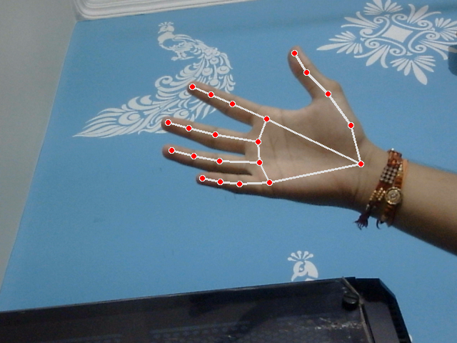
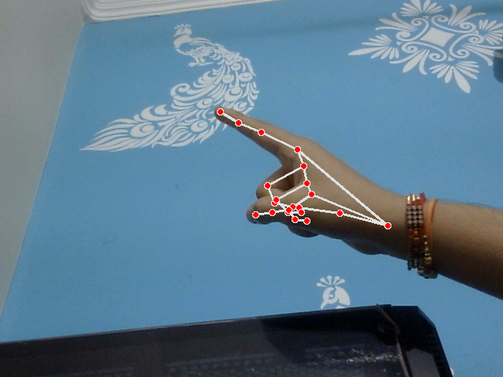
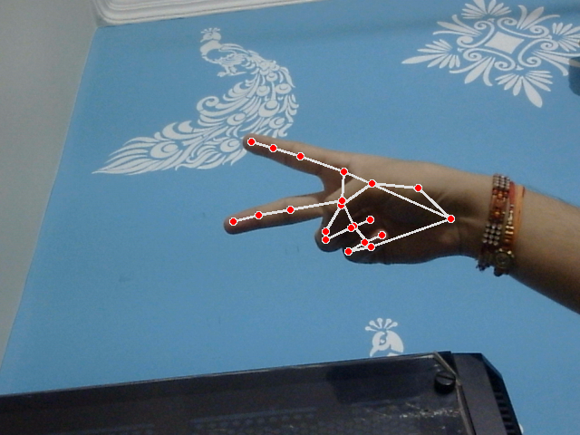
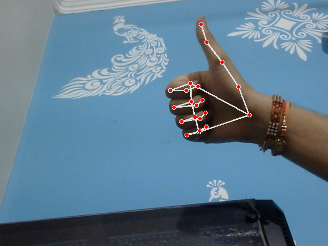

# Hand Detection Project

## Overview

The Hand Detection Project is designed to detect and locate hands in real-time from video feeds using MediaPipe and computer vision techniques. The project leverages MediaPipe’s hand tracking capabilities to identify hand regions, enabling applications such as gesture recognition and interactive interfaces.

## Features

- **Real-Time Hand Detection:** Utilizes MediaPipe for accurate and efficient hand tracking in live video feeds.
- **Keypoint Visualization:** Displays key points on detected hands for tracking and analysis.
- **Adaptability:** Handles different lighting conditions and hand variations effectively.

## Requirements

- Python 3.11
- OpenCV
- MediaPipe
- NumPy

## Hand Detection Examples

  
  
  
  

